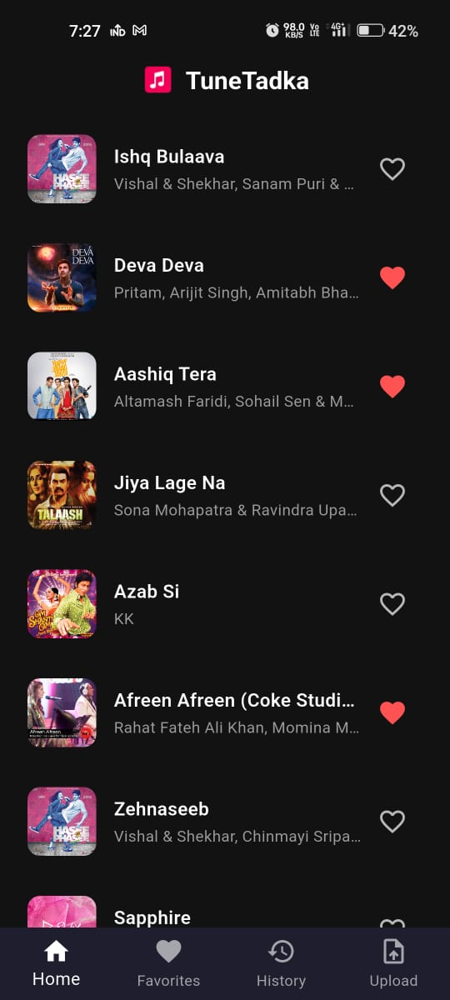
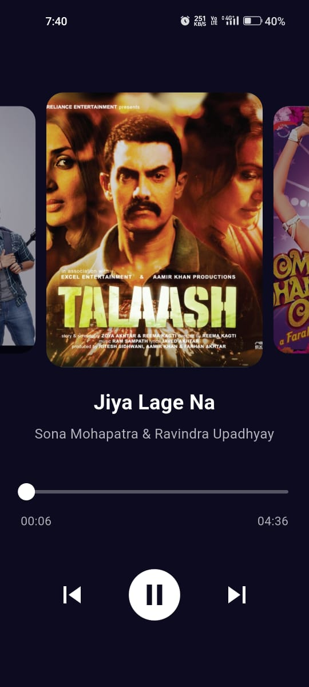
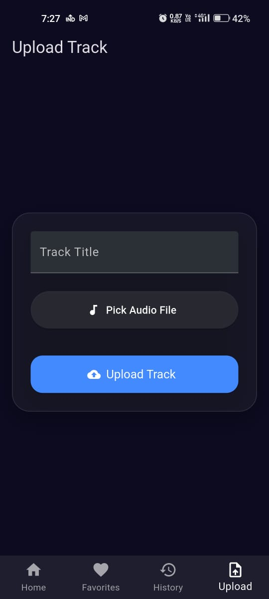

# 🎵 Tunetadka – A MP3 Music Player

**Tunetadka** is a cross-platform MP3 music player built using **Flutter** for the frontend and **Spring Boot** for the backend. It allows users to upload, stream, and play music with rich animations and background playback. It also integrates with **Firebase** for authentication and file handling, and uses a RESTful API hosted on Render.

---

## 🚀 Features

- 🎧 MP3 Playback using `just_audio`
- ⬆️ Upload music files with `file_picker` and `dio`
- 🖼️ Cached album art with `cached_network_image`
- 🧭 Smooth navigation with `go_router`
- 🎵 Background playback & notifications
- 🔥 Firebase integration for auth & storage
- 🌐 Backend REST API using Spring Boot
- 🎨 Custom splash screen & launcher icons

---

## 🌐 Backend API

- Deployed at: [`https://mp3-backend-ut8t.onrender.com`](https://mp3-backend-ut8t.onrender.com)
- Built using **Spring Boot**
- Exposes secure REST endpoints for:
  - Uploading music
  - Fetching tracks
  - User authentication (via Firebase Admin SDK)
  - Metadata management

---

## 🧰 Tech Stack

### Frontend – Flutter
| Package | Purpose |
|--------|---------|
| `just_audio`, `just_audio_background`, `audio_session` | Audio playback & background control |
| `cached_network_image` | Efficient image caching |
| `dio`, `http` | Network calls & file uploads |
| `file_picker` | Uploading local MP3 files |
| `go_router` | Advanced routing & navigation |
| `flutter_animate`, `flutter_staggered_animations` | Beautiful UI animations |
| `marquee` | Scrolling song titles |
| `flutter_launcher_icons`, `flutter_native_splash` | Custom icons and splash screen |

### Backend – Spring Boot
- RESTful APIs
- Firebase Admin SDK for authentication
- Secure endpoints for file handling and streaming

---

## 📸 Screenshots

### 🎵 Home Screen


### 🎧 Player Screen


### ⬆️ Upload Screen


## 📦 Getting Started

### Prerequisites

- Flutter SDK `>=3.7.2`
- Java 17+ (for backend)
- Firebase project setup with Admin SDK credentials

### Clone the repo

```bash
git clone https://github.com/your-username/tunetadka.git
cd tunetadka
